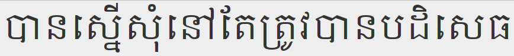
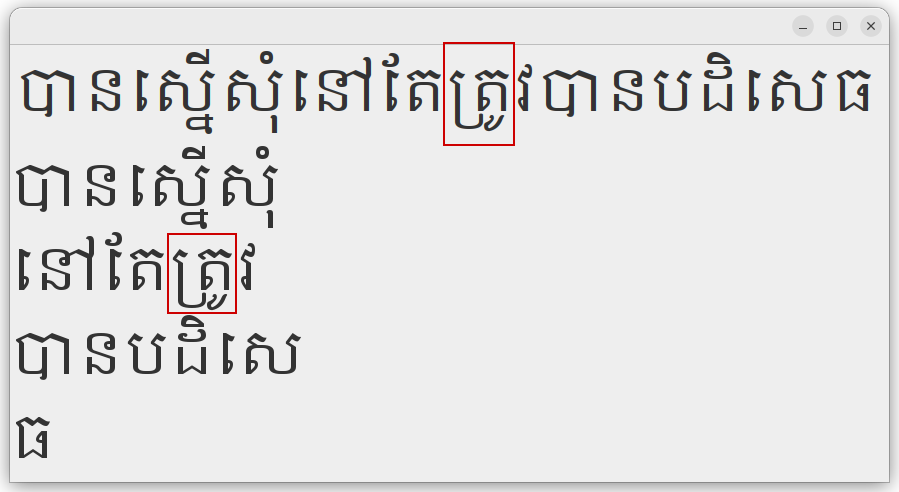
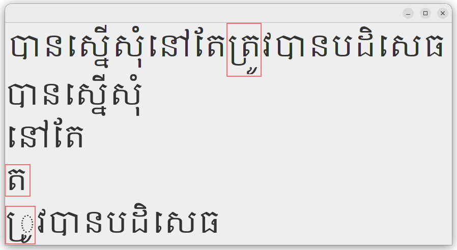

## Font Layout in OpenJDK

This is a collection of documents, links and personal insights I gathered while I was analysing [JDK-8361381: GlyphLayout behavior differs on JDK 11+ compared to JDK 8](https://bugs.openjdk.org/browse/JDK-8361381) and probably only serve as a crutch for my own leaky memory :)

> [!NOTE]
> Make sure your browser can display Khmer characters correctly in order to see all the content of this page! If the Khmer text between the following quotation marks "បានស្នើសុំនៅតែត្រូវបានបដិសេធ" looks more or less the same like the following picture, you should be fine.
> 

### The problem

A customer reported a regression in JDK 9+ which leads to bad/wrong line breaks for text in the Khmer language. Khmer is a [complex script](https://en.wikipedia.org/wiki/Khmer_script) which was only added to the Unicode standard 3.0 in 1999 (in the [Unicode block U+1780..U+17FF](https://en.wikipedia.org/wiki/Khmer_(Unicode_block))) and I personally don't understand Khmer at all :)

Fortunately, the customer could provide a [simple reproducer](https://bugs.openjdk.org/secure/attachment/115218/KhmerTest.java) which I could further condense to the following example: "បានស្នើសុំនៅតែត្រូវបានបដិសេធ" (according to Google translate, this means "*Requested but still denied*"). If we use OpenJDK's [`LineBreakMeasurer`](https://docs.oracle.com/en/java/javase/24/docs/api/java.desktop/java/awt/font/LineBreakMeasurer.html) to layout that paragraph (notice that Khmer has no spaces between words) to fit within a specific "wrapping width", the output may look as follows with JDK 8 (the exact output depends on the font and the wrapping width):
```
Segment: បានស្នើសុំ 0 10
Segment: នៅតែត្រូវ 10 9
Segment: បានបដិសេ 19 8
Segment: ធ 27 1
```
I ran with both, the logical [DIALOG](https://docs.oracle.com/en/java/javase/24/docs/api/java.desktop/java/awt/Font.html#DIALOG) font or directly with `/usr/share/fonts/truetype/ttf-khmeros-core/KhmerOS.ttf` on Ubuntu 22.04 (on my system DIALOG will automatically fall back to the KhmerOS font for characters from the Khmer Unicode code block). I also tried with the [Noto Khmer](https://fonts.google.com/noto/specimen/Noto+Serif+Khmer) fonts but the results were similar, so I'll stick to KhmerOS for the reminder of this blog.

As you can see, the paragraph was broken after the 10th, 19th, and 27th characters respectively. However, with JDK 9+, the output regresses to:
```
Segment: បានស្នើសុំ 0 10
Segment: នៅតែ 10 4
Segment: ត 14 1
Segment: ្រូវបានបដិសេធ 15 13
```
We now have a premature break after 14 characters, a segment with just a single character and the last line is too long.

In order to verify if there's a difference in the layout and rendering of this sentence between JDK 8 and 9+ I [extended the initial reproducer](./src/java/KhmerTestSwing.java) to paint the whole sentence as well as the single line segments into a Swing `JPanel`. Here's the result for JDK 8:



And JDK 9+:



As can be seen, the whole sentence is layout and rendered correctly in JDK 9+ as well, as long as it completely fits into a single line. However, in JDK 9+ there's an issue with line breaking at the "ត្រូ" ligature (highlighted with a red box in the above pictures). This specific ligature is composed from the glyphs of four Unicode code  points, namely `U+178F` ("ត", KHMER LETTER TA), `U+17D2` ("្", KHMER SIGN COENG), `U+179A` ("រ", KHMER LETTER RO), `U+17BC` ("ូ", KHMER VOWEL SIGN UU) ". If rendered correctly, `U+179A` is reordered (visually) before `U+178F` and `U+17BC` below `U+179A`. The visual reordering of `U+179A` before `U+178F` is controlled by `U+17D2` which is not itself represented visually.

In OpenJDK, all this complex text layout is performed by a so called text layout or text shaping engine. Up to and including JDK 8, OpenJDK has used the [ICU Layout Engine](https://unicode-org.github.io/icu/userguide/layoutengine/) for this task. In JDK 9, the ICU layout engine was deprecated and replaced by [Harfbuzz](https://github.com/harfbuzz/harfbuzz) (see [JEP 258: HarfBuzz Font-Layout Engine](https://bugs.openjdk.org/browse/JDK-8064530)). Whenever OpenJDK will have to do complex text layout, it will eventually call into tha native layout engine. For the current JDK 25 this looks as follows:

```java
at sun.font.HBShaper.shape(HBShaper.java:460)
at sun.font.SunLayoutEngine.layout(SunLayoutEngine.java:182)
at sun.font.GlyphLayout$EngineRecord.layout(GlyphLayout.java:669)
at sun.font.GlyphLayout.layout(GlyphLayout.java:459)
at sun.font.GlyphLayout.layout(GlyphLayout.java:357)
at sun.font.ExtendedTextSourceLabel.createGV(ExtendedTextSourceLabel.java:333)
at sun.font.ExtendedTextSourceLabel.getGV(ExtendedTextSourceLabel.java:319)
at sun.font.ExtendedTextSourceLabel.createCharinfo(ExtendedTextSourceLabel.java:638)
at sun.font.ExtendedTextSourceLabel.getCharinfo(ExtendedTextSourceLabel.java:563)
at sun.font.ExtendedTextSourceLabel.getLineBreakIndex(ExtendedTextSourceLabel.java:486)
at java.awt.font.TextMeasurer.calcLineBreak(TextMeasurer.java:330)
at java.awt.font.TextMeasurer.getLineBreakIndex(TextMeasurer.java:566)
at java.awt.font.LineBreakMeasurer.nextOffset(LineBreakMeasurer.java:360)
at java.awt.font.LineBreakMeasurer.nextOffset(LineBreakMeasurer.java:329)
at KhmerTestSwing.main(KhmerTestSwing.java:82)
```

Notice that since JDK 22, this is done through a new FFM based interface defined in [`HBShaper_Panama.c`](https://github.com/openjdk/jdk/blob/jdk25/src/java.desktop/share/native/libfontmanager/HBShaper_Panama.c) (see [8318364: Add an FFM-based implementation of harfbuzz OpenType layout](https://bugs.openjdk.org/browse/JDK-8318364)) by default, but can still be configured to use the old JNI-based interface (in [`HBShaper.c`](https://github.com/openjdk/jdk/blob/jdk25/src/java.desktop/share/native/libfontmanager/HBShaper.c)) with the `-Dsun.font.layout.ffm=false` system property. In the end, they both call into the bundled, native HarfBuzz function [`hb_shape_full(..)`](https://github.com/openjdk/jdk/blob/6c48f4ed707bf0b15f9b6098de30db8aae6fa40f/src/java.desktop/share/native/libharfbuzz/hb-shape.cc#L127) which takes a font and a buffer of characters (i.e. Unicode code points) as input and returns a buffer of font glyphs along with their metrics and some meta-information as output (here you can find the original [HarfBuzz upstream version](https://github.com/harfbuzz/harfbuzz/blob/0a257b0188ce8b002b51d9955713cd7136ca4769/src/hb-shape.cc#L127)).

HarfBuzz has a [nice documentation](https://harfbuzz.github.io/index.html) which explains a lot of the concepts involved in complex text layout (called "shaping" in HrafBuzz). The relevant part for this discussion is the section on [Clusters and shaping](https://harfbuzz.github.io/clusters.html#clusters-and-shaping) which basically explains the implementation and usage of the [`hb_shape_full()](https://harfbuzz.github.io/harfbuzz-hb-shape.html#hb-shape-full) function.

Previously, in JDK 8, `SunLayoutEngine::layout()` called the native `SunLayoutEngine::nativeLayout()` function which called right into the native, bundled ICU method [`LayoutEngine::layoutChars()`](https://github.com/openjdk/jdk8u-dev/blob/89b85a8f5b0f8e4f7763cf9b4d15e051d6e9f43f/jdk/src/share/native/sun/font/layout/LayoutEngine.cpp#L553) (here's the original [ICU upstream version](https://github.com/unicode-org/icu/blob/8fbc9902bd2ec278ae471b8215cdcc2d1cf13555/source/layout/LayoutEngine.cpp#L442)). The ICU Layout engine is documented [here](https://unicode-org.github.io/icu/userguide/layoutengine/).

The GitHub HarfBuzz organization contains the [`icu-le-hb`](https://github.com/harfbuzz/icu-le-hb) repository which provides a library implementing the ICU Layout Engine API
using the HarfBuzz library as implementation. It's [`LayoutEngine::layoutChars()`](https://github.com/harfbuzz/icu-le-hb/blob/01b8e255d08a9ea2c2a0665f2b673fe9e71c7ec1/src/LayoutEngine.cpp#L180) demonstrates how HarfBuzz can be invoked to simulate ICU's layout functionality. We'll revisit its implementation later in this document.

### The differences between the ICU and HarfBuzz layout

In order to identify the differences between the two layout engines, we can use the system property `-Dsun.java2d.debugfonts=true` on JDK 9+. For JDK 8, we have to recompile the JDK and set the private, boolean [`DEBUG`](https://github.com/openjdk/jdk8u-dev/blob/89b85a8f5b0f8e4f7763cf9b4d15e051d6e9f43f/jdk/src/share/classes/sun/font/ExtendedTextSourceLabel.java#L640) field in the `sun.font.ExtendedTextSourceLabel` class to true in order to get a similar output. In JDK 8 this will result in the following output for our example program:

```
number of glyphs: 30
glyphinfo.len: 240
indices.len: 30
g: 0  v: 455, x: 0.0, a: 68.115234, n: 0
g: 1  v: 65534, x: 68.115234, a: 0.0, n: 1
g: 2  v: 581, x: 68.115234, a: 45.410156, n: 2
g: 3  v: 627, x: 113.52539, a: 22.705078, n: 6
g: 4  v: 593, x: 136.23047, a: 68.115234, n: 3
g: 5  v: 402, x: 205.07812, a: 0.0, n: 4
g: 6  v: 65535, x: 204.3457, a: 0.0, n: 5
g: 7  v: 714, x: 203.61328, a: 0.0, n: 6
g: 8  v: 593, x: 204.3457, a: 68.115234, n: 7
g: 9  v: 621, x: 271.72852, a: 0.0, n: 8
g: 10  v: 632, x: 271.72852, a: 0.0, n: 9
g: 11  v: 627, x: 272.46094, a: 22.705078, n: 11
g: 12  v: 503, x: 295.16602, a: 68.115234, n: 10
g: 13  v: 65534, x: 363.28125, a: 0.0, n: 11
g: 14  v: 628, x: 363.28125, a: 22.705078, n: 13
g: 15  v: 577, x: 385.98633, a: 45.410156, n: 12
g: 16  v: 409, x: 431.39648, a: 22.705078, n: 15
g: 17  v: 65535, x: 454.10156, a: 0.0, n: 16
g: 18  v: 577, x: 454.10156, a: 45.410156, n: 14
g: 19  v: 622, x: 498.04688, a: 0.0, n: 17
g: 20  v: 590, x: 499.51172, a: 22.705078, n: 18
g: 21  v: 455, x: 522.2168, a: 68.115234, n: 19
g: 22  v: 65534, x: 590.33203, a: 0.0, n: 20
g: 23  v: 581, x: 590.33203, a: 45.410156, n: 21
g: 24  v: 582, x: 635.7422, a: 45.410156, n: 22
g: 25  v: 572, x: 681.15234, a: 45.410156, n: 23
g: 26  v: 617, x: 725.09766, a: 0.0, n: 24
g: 27  v: 627, x: 726.5625, a: 22.705078, n: 26
g: 28  v: 593, x: 749.2676, a: 68.115234, n: 25
g: 29  v: 580, x: 817.3828, a: 45.410156, n: 27
```

First, there's the glyph list produced by layout engine. It contains 30 glyphs (two more than the 28 characters of our input text). For each glyph, it prints the glyph ID in the font that we've used, the x-position of that glyph in the final image and the [advance](https://docs.oracle.com/en/java/javase/24/docs/api/java.desktop/java/awt/font/GlyphMetrics.html#getAdvance()), i.e. the space up to the next glyph (notice that the advance can be zero). E.g. we can easily verify that the first glyph with the number 455 (i.e. "បា") corresponds to the the ligature of the first two characters `U+1794` ("ប", KHMER LETTER BA) and `U+17B6` ("ា", KHMER VOWEL SIGN AA) in our `KhmerOS.ttf` font by uploading that font file to https://fontdrop.info/ and searching for the glyph number 455 (the glyph name is `uni1794.a` which indicates that it is a ligature of the unicode character `U+1794` and the vowel AA).

The last column in the output is the [cluster number](https://harfbuzz.github.io/clusters.html#clusters-and-shaping) to which the corresponding glyph belongs to. So in our example, the zeroth glyph belongs to the zeroth cluster, while glyph one belongs to the first cluster. Glyph one is interesting, because we can't find a glyph with index 65534 in our font. Actually, glyph indices which are greater or equal to 65534 denote the

